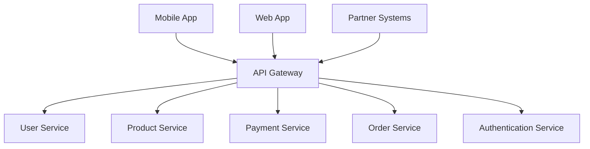
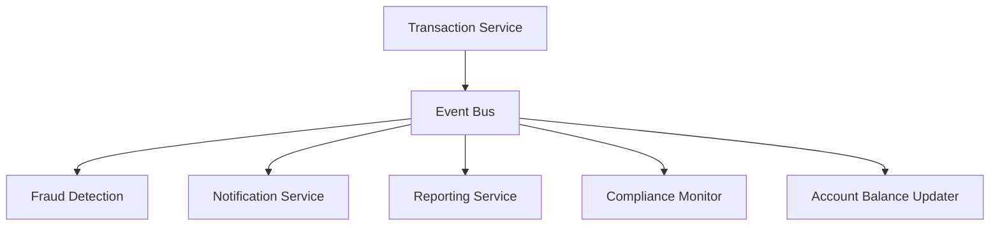
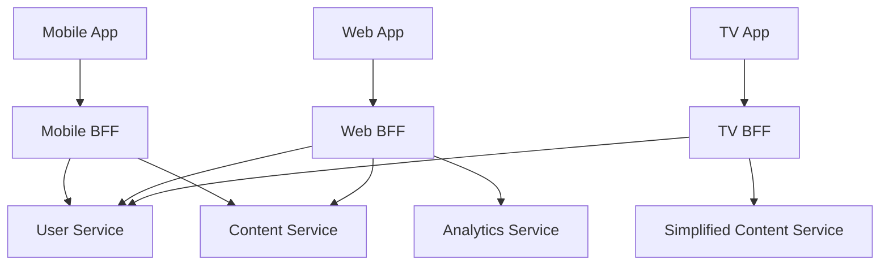

## Application & System Integration

### 1. API Gateway Pattern
**Category:** Integration

**Problem Statement:** Multiple clients need to access various microservices, leading to complex client-side logic, security concerns, and coupling between clients and services.

**Solution Approach:** Implement a centralized API Gateway that acts as a single entry point for all client requests, handling routing, authentication, rate limiting, and request/response transformation.

**Context & Applicability:**
- Microservices architecture
- Multiple client types (web, mobile, IoT)
- Need for centralized cross-cutting concerns
- External API exposure

**Benefits:**
- Simplified client interactions
- Centralized security and monitoring
- Protocol translation capabilities
- Reduced client-service coupling
- Consistent API versioning

**Trade-offs / Limitations:**
- Single point of failure risk
- Potential performance bottleneck
- Additional complexity in deployment
- Gateway maintenance overhead

**Example Use Case:** E-commerce platform where mobile apps, web applications, and partner systems access product catalog, user management, and payment services through a unified API Gateway.

**Best Practices:**
- Implement health checks and circuit breakers
- Use caching for frequently accessed data
- Implement proper rate limiting
- Version APIs appropriately
- Monitor gateway performance metrics

**Anti-Patterns:**
- Creating a monolithic gateway
- Implementing business logic in the gateway
- Not planning for gateway high availability
- Ignoring API versioning strategies

---

### 2. Event-Driven Architecture Pattern
**Category:** Integration

**Problem Statement:** Tight coupling between systems leads to cascading failures, difficulty in scaling individual components, and challenges in handling asynchronous processing.

**Solution Approach:** Implement loose coupling through event publishing and subscription, where services communicate via events rather than direct calls.

**Context & Applicability:**
- High-volume transaction systems
- Real-time data processing needs
- Microservices requiring loose coupling
- Systems with complex business workflows

**Benefits:**
- Improved system resilience
- Better scalability and flexibility
- Easier to add new consumers
- Natural audit trail
- Supports eventual consistency

**Trade-offs / Limitations:**
- Increased complexity in debugging
- Eventual consistency challenges
- Event schema evolution complexity
- Potential message ordering issues

**Example Use Case:** Banking system where account transactions trigger events for fraud detection, notification services, reporting systems, and compliance monitoring without direct service dependencies.

**Best Practices:**
- Design idempotent event handlers
- Implement event versioning strategy
- Use dead letter queues for failed events
- Monitor event processing latency
- Implement event replay capabilities

**Anti-Patterns:**
- Creating chatty event interfaces
- Not handling duplicate events
- Ignoring event ordering requirements
- Missing event schema governance

---

### 3. Backend for Frontend (BFF) Pattern
**Category:** Integration

**Problem Statement:** Different client types (mobile, web, IoT) have varying data requirements and capabilities, leading to over-fetching or multiple API calls.

**Solution Approach:** Create dedicated backend services tailored to specific frontend requirements, optimizing data aggregation and formatting for each client type.

**Context & Applicability:**
- Multiple client types with different needs
- Mobile applications with bandwidth constraints
- Complex data aggregation requirements
- Need for client-specific optimizations

**Benefits:**
- Optimized data transfer for each client
- Reduced client complexity
- Better performance for mobile clients
- Team autonomy for different client teams
- Simplified client development

**Trade-offs / Limitations:**
- Code duplication across BFFs
- Additional maintenance overhead
- Potential for BFF sprawl
- Increased deployment complexity

**Example Use Case:** Social media platform with dedicated BFFs for mobile app (optimized for limited bandwidth), web application (rich data sets), and smart TV app (simplified interface requirements).

**Best Practices:**
- Share common logic through libraries
- Implement consistent error handling
- Use GraphQL for flexible data fetching
- Monitor BFF performance separately
- Implement proper caching strategies

**Anti-Patterns:**
- Creating too many specialized BFFs
- Implementing business logic in BFFs
- Not sharing common utilities
- Ignoring performance optimization

---
