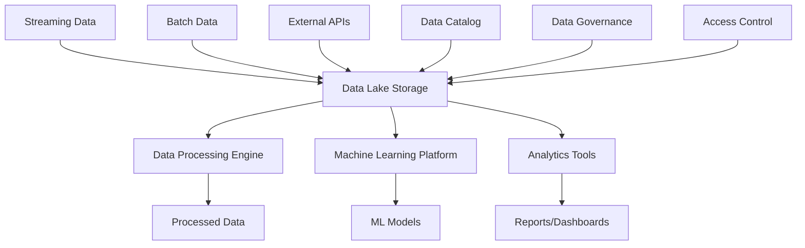
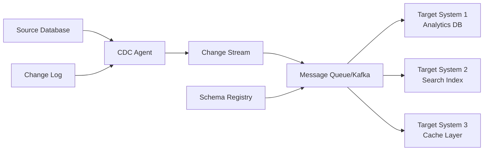
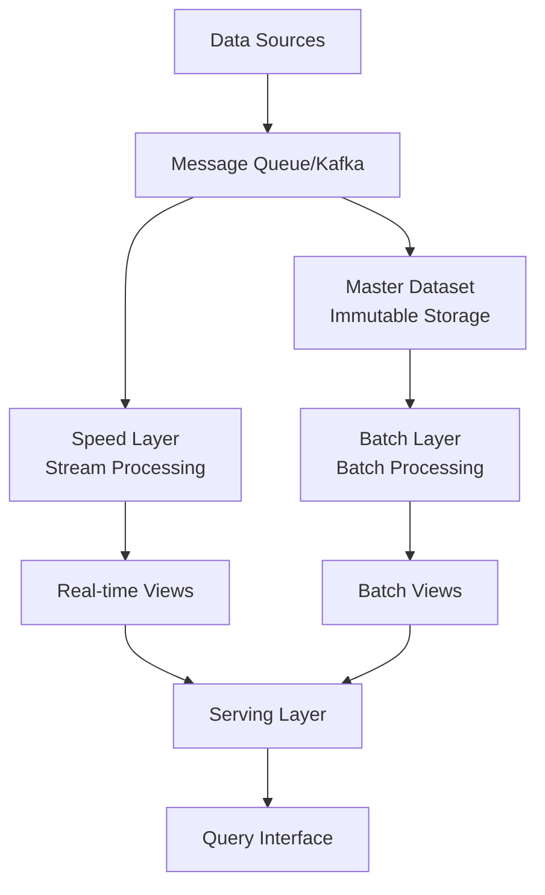

## Data & Analytics

### 10. Data Lake Architecture Pattern
**Category:** Data

**Problem Statement:** Organizations need to store and process large volumes of structured and unstructured data from various sources for analytics and machine learning.

**Solution Approach:** Implement a centralized repository that stores raw data in native formats with schema-on-read capabilities and multiple processing engines.

**Context & Applicability:**
- Big data analytics requirements
- Multiple data source integration
- Machine learning and AI initiatives
- Real-time and batch processing needs
- Cost-effective data storage requirements

**Benefits:**
- Flexible data storage formats
- Cost-effective storage solutions
- Supports various analytics tools
- Scalable processing capabilities
- Data democratization opportunities

**Trade-offs / Limitations:**
- Data governance complexity
- Quality control challenges
- Security and access control complexity
- Potential for data swamps
- Skills requirement for management

**Example Use Case:** Insurance company collecting customer data, claims data, IoT sensor data from vehicles, and external market data for risk assessment models and predictive analytics.

**Best Practices:**
- Implement data cataloging and lineage
- Establish data quality monitoring
- Use partitioning strategies
- Implement proper access controls
- Plan for data lifecycle management

**Anti-Patterns:**
- Not implementing data governance
- Ignoring data quality issues
- Creating data silos within the lake
- Not planning for data discovery

---

### 11. Change Data Capture (CDC) Pattern
**Category:** Data

**Problem Statement:** Real-time data synchronization between operational databases and analytical systems without impacting production performance.

**Solution Approach:** Capture and stream database changes in real-time using transaction logs or triggers to maintain synchronized copies of data across systems.

**Context & Applicability:**
- Real-time analytics requirements
- Data replication across environments
- Event-driven architectures
- Database migration scenarios
- Microservices data synchronization

**Benefits:**
- Real-time data availability
- Minimal impact on source systems
- Complete change history
- Enables event-driven patterns
- Supports data democratization

**Trade-offs / Limitations:**
- Complex implementation
- Schema evolution challenges
- Network and storage overhead
- Potential data consistency issues
- Monitoring complexity

**Example Use Case:** E-commerce platform capturing product catalog changes, inventory updates, and customer profile modifications to update search indexes, recommendation engines, and business intelligence systems in real-time.

**Best Practices:**
- Implement proper error handling and retries
- Monitor replication lag
- Plan for schema evolution
- Use idempotent processing
- Implement backpressure handling

**Anti-Patterns:**
- Not handling schema changes
- Ignoring failure scenarios
- Creating circular dependencies
- Not monitoring data consistency

---

### 12. Lambda Architecture Pattern
**Category:** Data

**Problem Statement:** Need to support both real-time and batch processing of large-scale data while maintaining accuracy and handling late-arriving data.

**Solution Approach:** Implement parallel batch and speed processing layers that feed into a serving layer, providing both real-time views and eventually consistent batch-processed views.

**Context & Applicability:**
- Real-time analytics with historical data
- High-volume streaming data processing
- Need for both speed and accuracy
- Complex event processing requirements
- Systems requiring fault tolerance

**Benefits:**
- Handles high-volume data streams
- Provides both real-time and batch views
- Fault-tolerant architecture
- Supports complex analytics
- Flexibility in processing approaches

**Trade-offs / Limitations:**
- High complexity in implementation
- Duplicate processing logic
- Higher operational overhead
- Potential data inconsistencies
- Resource intensive

**Example Use Case:** Social media analytics platform processing millions of posts and interactions in real-time for trending topics while also performing complex batch analysis for detailed engagement metrics and user behavior patterns.

**Best Practices:**
- Keep processing logic consistent across layers
- Implement proper data lineage tracking
- Use immutable data storage
- Plan for data reprocessing scenarios
- Monitor processing latencies

**Anti-Patterns:**
- Implementing different logic in batch and speed layers
- Not planning for late data handling
- Ignoring operational complexity
- Not considering simpler alternatives

---
