## DevOps & Automation

### 18. GitOps Deployment Pattern
**Category:** DevOps

**Problem Statement:** Manual deployment processes and configuration drift lead to inconsistent environments, security risks, and difficult troubleshooting.

**Solution Approach:** Use Git repositories as the single source of truth for infrastructure and application configurations, with automated agents ensuring desired state.

**Context & Applicability:**
- Kubernetes and container environments
- Infrastructure as Code adoption
- Multiple environment management
- Audit and compliance requirements
- Team collaboration improvements

**Benefits:**
- Declarative infrastructure management
- Version-controlled deployments
- Improved security through pull-based deployments
- Easy rollback capabilities
- Better collaboration and transparency

**Trade-offs / Limitations:**
- Learning curve for Git workflows
- Requires cultural change
- Initial setup complexity
- Git repository becomes critical dependency
- Potential secrets management challenges

**Example Use Case:** Microservices platform where development teams commit Kubernetes manifests to Git, triggering automated deployments to staging and production environments with full audit trails.

**Best Practices:**
- Implement proper branching strategies
- Use separate repositories for different concerns
- Implement automated testing in pipelines
- Secure secrets management
- Monitor deployment health

**Anti-Patterns:**
- Storing secrets in Git repositories
- Not implementing proper access controls
- Manual override of GitOps processes
- Ignoring configuration validation

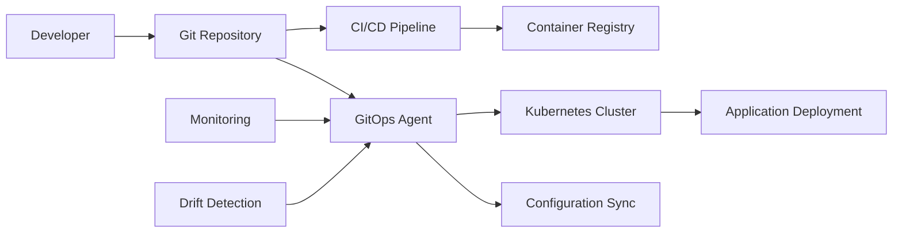

---

### 19. Infrastructure as Code (IaC) Pattern
**Category:** DevOps

**Problem Statement:** Manual infrastructure provisioning leads to inconsistent environments, configuration drift, and difficulty in scaling and reproducing environments.

**Solution Approach:** Define infrastructure using declarative code that can be version-controlled, tested, and automatically provisioned across environments.

**Context & Applicability:**
- Cloud infrastructure management
- Multiple environment requirements
- Disaster recovery automation
- Compliance and audit needs
- Team scaling and knowledge sharing

**Benefits:**
- Consistent environment provisioning
- Version control for infrastructure
- Automated disaster recovery
- Reduced manual errors
- Improved collaboration

**Trade-offs / Limitations:**
- Learning curve for IaC tools
- State management complexity
- Initial investment in tooling
- Potential for destructive changes
- Tool lock-in risks

**Example Use Case:** Multi-tier web application infrastructure (load balancers, web servers, databases, networking) provisioned consistently across development, staging, and production environments using Terraform.

**Best Practices:**
- Use modular and reusable code
- Implement proper state management
- Version control all infrastructure code
- Test infrastructure changes in isolation
- Implement proper access controls

**Anti-Patterns:**
- Manual modifications to managed infrastructure
- Not using version control for IaC
- Creating monolithic infrastructure templates
- Ignoring state file security

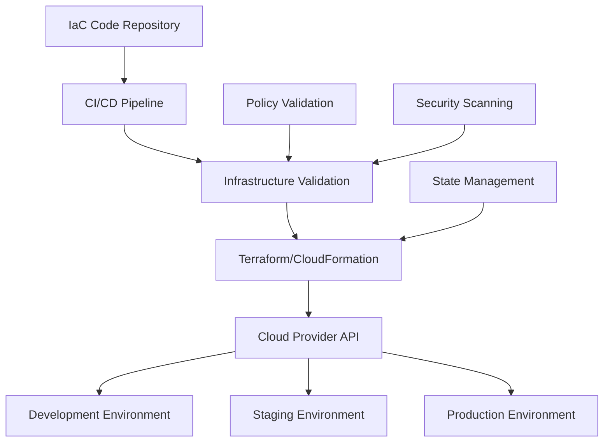

---

### 20. CI/CD Pipeline Pattern
**Category:** DevOps

**Problem Statement:** Manual deployment processes are error-prone, slow, and create bottlenecks that prevent rapid delivery of software changes to production.

**Solution Approach:** Implement automated continuous integration and continuous deployment pipelines that build, test, and deploy code changes automatically through multiple environments.

**Context & Applicability:**
- Any software development project
- Teams requiring rapid deployment cycles
- Quality assurance automation needs
- Multiple environment management
- Risk reduction in deployments

**Benefits:**
- Faster time to market
- Reduced deployment errors
- Consistent deployment processes
- Early detection of integration issues
- Improved developer productivity

**Trade-offs / Limitations:**
- Initial setup complexity
- Requires comprehensive test coverage
- Pipeline maintenance overhead
- Potential for automated deployment of bugs
- Tool and infrastructure costs

**Example Use Case:** E-commerce platform where code commits trigger automated builds, run unit/integration tests, deploy to staging for acceptance testing, and automatically promote to production after approval gates.

**Best Practices:**
- Implement comprehensive automated testing
- Use feature flags for risk mitigation
- Implement proper approval gates
- Monitor pipeline performance metrics
- Maintain pipeline as code

**Anti-Patterns:**
- Skipping automated testing for speed
- Manual steps in automated pipelines
- Not implementing proper rollback mechanisms
- Ignoring pipeline security

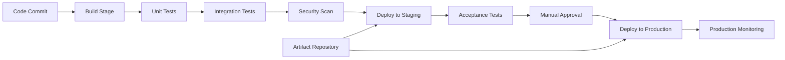

---

### 21. Configuration Management Pattern
**Category:** DevOps

**Problem Statement:** Application configurations scattered across environments lead to inconsistencies, security risks, and difficult troubleshooting across different deployment stages.

**Solution Approach:** Centralize configuration management with environment-specific overrides, version control, and secure secret management separate from application code.

**Context & Applicability:**
- Multi-environment deployments
- Microservices architectures
- Cloud-native applications
- Applications requiring frequent configuration changes
- Security-sensitive configuration requirements

**Benefits:**
- Centralized configuration management
- Environment-specific customization
- Secure secrets handling
- Configuration version control
- Dynamic configuration updates

**Trade-offs / Limitations:**
- Additional infrastructure complexity
- Potential single point of failure
- Network dependency for configuration
- Learning curve for teams
- Configuration drift monitoring needs

**Example Use Case:** Microservices-based banking application using centralized configuration server to manage database connections, feature flags, and API keys across development, testing, and production environments.

**Best Practices:**
- Separate secrets from regular configuration
- Implement configuration validation
- Use environment-specific profiles
- Version control configuration changes
- Monitor configuration access and changes

**Anti-Patterns:**
- Hardcoding configuration in application code
- Storing secrets in plain text
- Not versioning configuration changes
- Single configuration for all environments

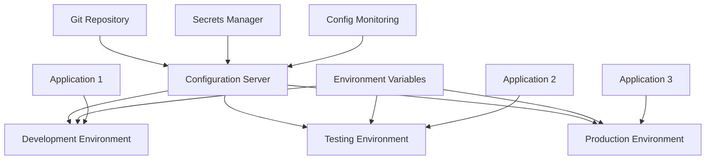

---

### 22. Monitoring and Observability Pattern
**Category:** DevOps

**Problem Statement:** Limited visibility into distributed system behavior makes it difficult to detect issues, troubleshoot problems, and understand system performance.

**Solution Approach:** Implement comprehensive monitoring with metrics, logs, and distributed tracing to provide full observability into system behavior and performance.

**Context & Applicability:**
- Distributed and microservices architectures
- Production systems requiring high availability
- Performance optimization needs
- Compliance and audit requirements
- Complex system troubleshooting

**Benefits:**
- Early problem detection
- Faster mean time to recovery
- Better performance optimization
- Improved user experience monitoring
- Data-driven decision making

**Trade-offs / Limitations:**
- Additional infrastructure and costs
- Data storage and retention challenges
- Alert fatigue potential
- Performance overhead from monitoring
- Complexity in tool integration

**Example Use Case:** E-commerce platform implementing distributed tracing to track user transactions across multiple microservices, collecting performance metrics, and correlating logs for rapid issue identification.

**Best Practices:**
- Implement structured logging
- Use distributed tracing for request flows
- Set up meaningful alerts and dashboards
- Collect both technical and business metrics
- Implement log aggregation and correlation

**Anti-Patterns:**
- Monitoring everything without purpose
- Not correlating metrics, logs, and traces
- Creating too many noisy alerts
- Ignoring business metrics

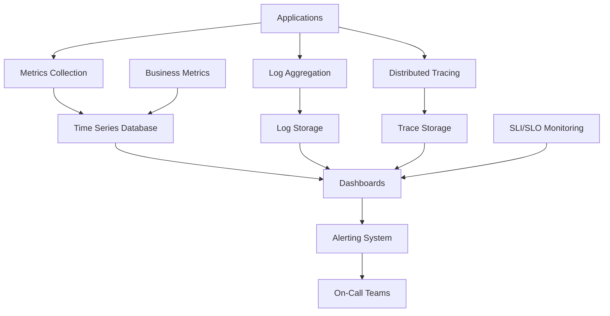

---

### 23. Automated Testing Pipeline Pattern
**Category:** DevOps

**Problem Statement:** Manual testing is slow, inconsistent, and cannot keep pace with rapid deployment cycles, leading to quality issues in production.

**Solution Approach:** Implement comprehensive automated testing at multiple levels (unit, integration, system, performance) integrated into CI/CD pipelines with quality gates.

**Context & Applicability:**
- Agile and DevOps development practices
- Frequent deployment requirements
- Quality assurance automation
- Regression testing needs
- Large-scale application development

**Benefits:**
- Faster feedback on code quality
- Consistent testing execution
- Reduced manual testing effort
- Early bug detection
- Confidence in deployment quality

**Trade-offs / Limitations:**
- Initial investment in test automation
- Maintenance of test suites
- Potential for brittle tests
- Coverage gaps in automated testing
- Skills requirement for test automation

**Example Use Case:** Online banking application with automated unit tests, API integration tests, UI automation tests, security scans, and performance tests running at different pipeline stages before production deployment.

**Best Practices:**
- Follow testing pyramid principles
- Implement test data management
- Use parallel test execution
- Maintain test environment consistency
- Regular test suite maintenance

**Anti-Patterns:**
- Over-relying on UI automation tests
- Not maintaining test data properly
- Ignoring test execution time
- Creating brittle test automation

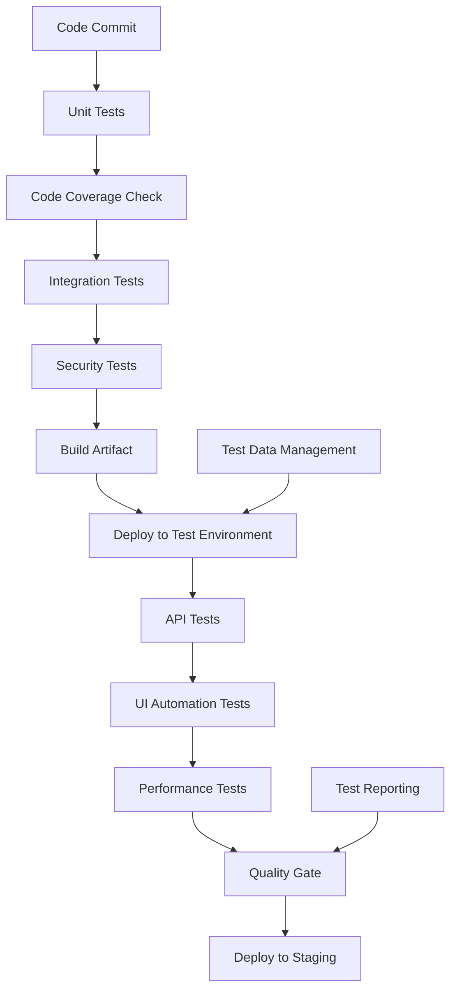

---

### 24. Blue-Green Database Pattern
**Category:** DevOps

**Problem Statement:** Database schema changes and data migrations during deployments can cause extended downtime and rollback complexity in production systems.

**Solution Approach:** Maintain parallel database environments for zero-downtime database deployments with synchronized data and seamless cutover capabilities.

**Context & Applicability:**
- Mission-critical database applications
- Zero-downtime deployment requirements
- Complex schema migration needs
- High-availability database systems
- Applications with strict SLAs

**Benefits:**
- Zero-downtime database deployments
- Safe schema migration testing
- Quick rollback capabilities
- Reduced deployment risks
- Maintained data consistency

**Trade-offs / Limitations:**
- Higher infrastructure costs
- Complex data synchronization
- Storage overhead for dual databases
- Synchronization lag considerations
- Requires careful transaction management

**Example Use Case:** Financial trading platform performing database schema updates and data migrations without any service interruption, maintaining transaction integrity throughout the deployment process.

**Best Practices:**
- Implement robust data synchronization
- Test migration procedures thoroughly
- Plan for transaction consistency
- Monitor synchronization lag
- Automate cutover procedures

**Anti-Patterns:**
- Not testing complete migration scenarios
- Ignoring data consistency during cutover
- Manual synchronization processes
- Not planning for rollback scenarios

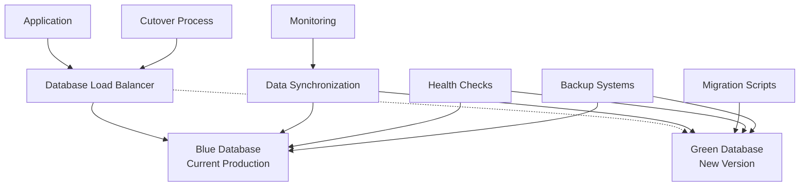

---

### 25. Secrets Management Pattern
**Category:** DevOps/Security

**Problem Statement:** Sensitive information like passwords, API keys, and certificates are scattered across environments, stored insecurely, and difficult to rotate.

**Solution Approach:** Centralize secrets management with encrypted storage, access controls, automatic rotation, and audit logging for all sensitive information.

**Context & Applicability:**
- Any application using sensitive credentials
- Multi-environment deployments
- Compliance and security requirements
- Microservices architectures
- Cloud-native applications

**Benefits:**
- Centralized secrets management
- Encrypted storage and transit
- Access control and auditing
- Automatic secret rotation
- Reduced security risks

**Trade-offs / Limitations:**
- Additional infrastructure complexity
- Potential single point of failure
- Network dependency for secret access
- Key management complexity
- Performance overhead

**Example Use Case:** Healthcare application managing database passwords, external API keys, and encryption certificates through centralized vault with automated rotation and compliance audit trails.

**Best Practices:**
- Implement least privilege access
- Use short-lived tokens when possible
- Automate secret rotation
- Audit all secret access
- Encrypt secrets at rest and in transit

**Anti-Patterns:**
- Storing secrets in code repositories
- Using long-lived static credentials
- Not implementing access controls
- Manual secret management processes

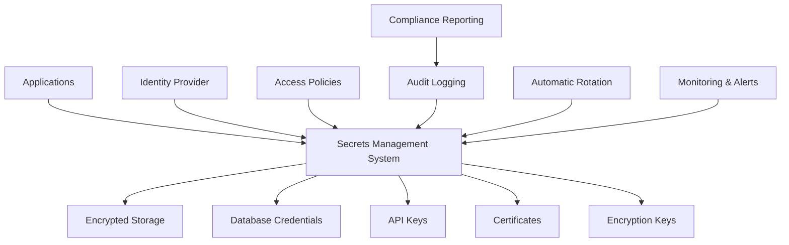

---

## Additional High-Value Patterns

### 26. Serverless Architecture Pattern
**Category:** Infrastructure/Scalability

**Problem Statement:** Traditional server-based architectures require constant resource provisioning, maintenance overhead, and don't automatically scale with demand fluctuations.

**Solution Approach:** Implement event-driven, stateless functions that automatically scale and are managed by cloud providers, paying only for actual execution time.

**Context & Applicability:**
- Event-driven applications
- Variable or unpredictable workloads
- Rapid prototyping requirements
- Cost-sensitive applications
- Microservices with clear boundaries

**Benefits:**
- Zero server management overhead
- Automatic scaling and high availability
- Pay-per-use cost model
- Fast deployment and iteration
- Built-in fault tolerance

**Trade-offs / Limitations:**
- Cold start latency issues
- Vendor lock-in concerns
- Limited execution time and memory
- Complex debugging and monitoring
- State management challenges

**Example Use Case:** E-commerce order processing where serverless functions handle payment processing, inventory updates, and notification sending, scaling automatically during flash sales.

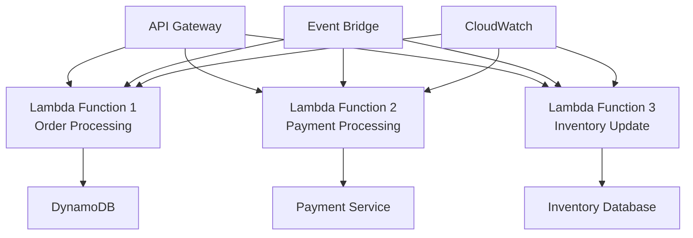

---

### 27. Micro-Frontend Pattern
**Category:** Integration/Scalability

**Problem Statement:** Large frontend applications become difficult to maintain, deploy, and scale across multiple teams, creating bottlenecks in development and deployment.

**Solution Approach:** Decompose frontend applications into smaller, independently deployable micro-applications that can be developed and maintained by different teams.

**Context & Applicability:**
- Large-scale web applications
- Multiple development teams
- Different technology stack requirements
- Independent deployment needs
- Complex user interfaces

**Benefits:**
- Team autonomy and parallel development
- Technology diversity and flexibility
- Independent deployment cycles
- Better fault isolation
- Easier maintenance and testing

**Trade-offs / Limitations:**
- Increased complexity in integration
- Potential performance overhead
- Shared state management challenges
- Consistent UX maintenance difficulty
- Bundle size and loading considerations

**Example Use Case:** Enterprise HR platform where different teams manage recruitment, payroll, and performance modules as separate micro-frontends integrated into a unified shell application.

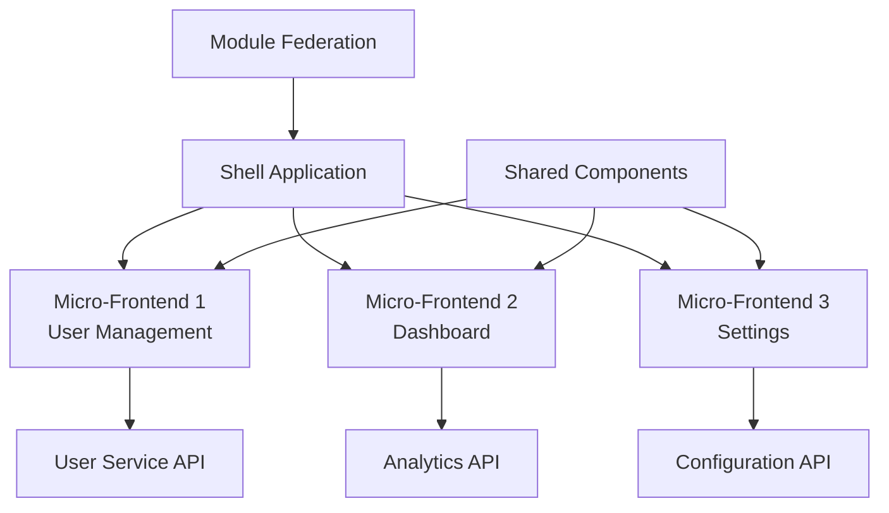

---

### 28. Data Mesh Pattern
**Category:** Data

**Problem Statement:** Centralized data platforms become bottlenecks, create data silos, and cannot scale with the diverse analytical needs of large organizations.

**Solution Approach:** Implement decentralized data ownership with domain-oriented data products, federated governance, and self-serve data infrastructure platform.

**Context & Applicability:**
- Large organizations with diverse data needs
- Multiple business domains
- Scalable analytics requirements
- Data democratization initiatives
- Complex data governance needs

**Benefits:**
- Scalable data architecture
- Domain expertise in data products
- Reduced central bottlenecks
- Improved data quality ownership
- Faster time to insights

**Trade-offs / Limitations:**
- Complex governance coordination
- Data discovery challenges
- Potential inconsistency across domains
- Higher infrastructure complexity
- Skills and cultural transformation needs

**Example Use Case:** Retail corporation where marketing, supply chain, and customer service domains each own their data products while sharing common infrastructure and governance standards.

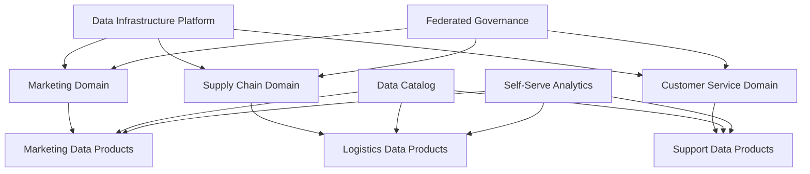

---

### 29. Strangler Fig Pattern
**Category:** Migration/Integration

**Problem Statement:** Legacy system modernization requires gradual replacement without disrupting business operations or requiring big-bang migrations.

**Solution Approach:** Gradually replace legacy system functionality by intercepting requests and routing them to new services while maintaining existing functionality during transition.

**Context & Applicability:**
- Legacy system modernization
- Risk-averse migration requirements
- Business continuity needs
- Large monolithic applications
- Gradual technology transformation

**Benefits:**
- Reduced migration risks
- Business continuity maintenance
- Incremental value delivery
- Parallel development capability
- Easier rollback options

**Trade-offs / Limitations:**
- Extended migration timeline
- Complexity in routing logic
- Data consistency challenges
- Dual system maintenance
- Integration complexity

**Example Use Case:** Banking core system migration where new microservices gradually replace monolithic functions like account management, payments, and reporting while maintaining 24/7 operations.

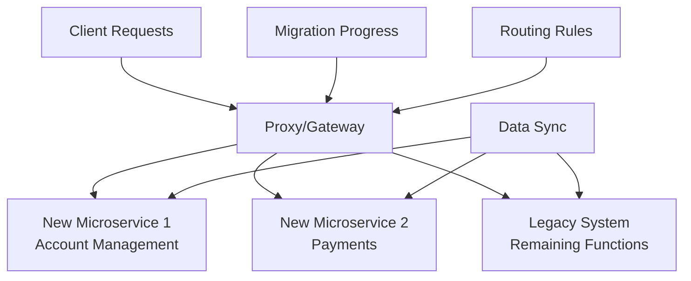

---

### 30. Edge Computing Pattern
**Category:** Infrastructure/Performance

**Problem Statement:** Centralized cloud processing creates latency issues for real-time applications and generates excessive data transfer costs for IoT and mobile applications.

**Solution Approach:** Deploy computing resources closer to data sources and end users, processing data at network edges to reduce latency and bandwidth usage.

**Context & Applicability:**
- IoT and sensor data processing
- Real-time application requirements
- Bandwidth-constrained environments
- Geographic distribution needs
- Regulatory data residency requirements

**Benefits:**
- Reduced latency and improved performance
- Lower bandwidth costs
- Better data privacy and security
- Improved reliability and availability
- Local processing capabilities

**Trade-offs / Limitations:**
- Distributed infrastructure complexity
- Edge device management overhead
- Limited processing capabilities
- Security management challenges
- Synchronization complexity

**Example Use Case:** Smart manufacturing where edge servers process machine sensor data locally for real-time quality control while sending aggregated data to central cloud for analytics.

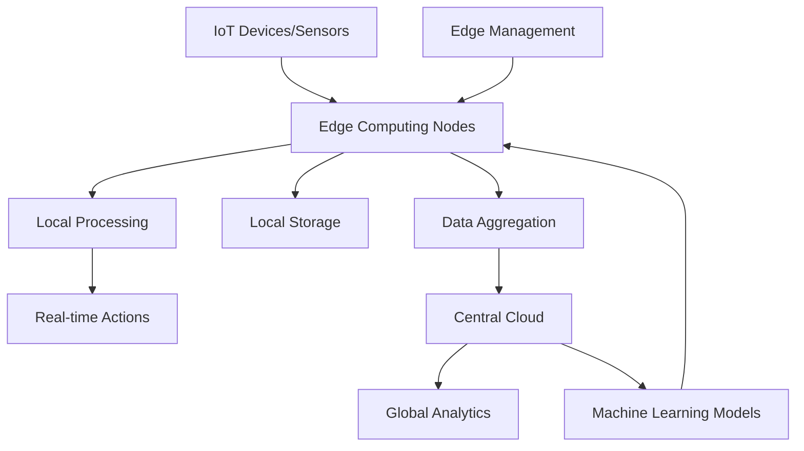

---
