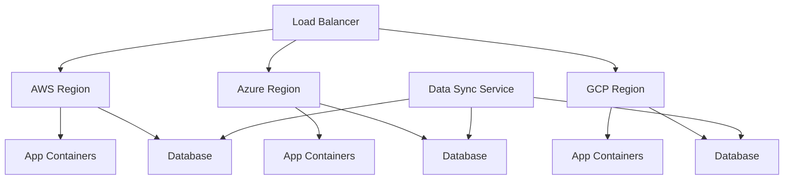
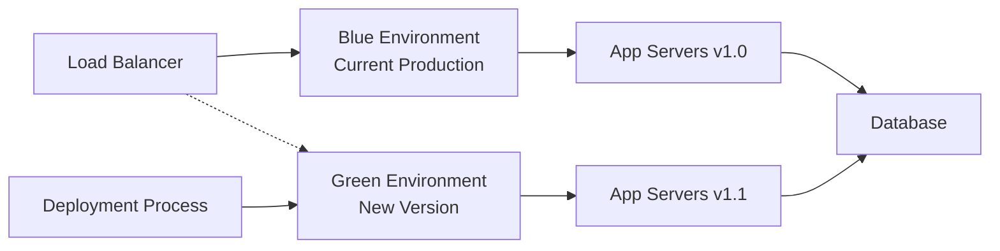
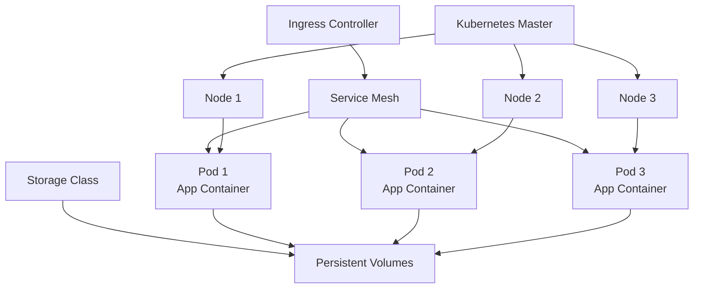

## Infrastructure & Cloud Deployment

### 4. Multi-Cloud Deployment Pattern
**Category:** Infrastructure

**Problem Statement:** Vendor lock-in risks, regulatory requirements for data sovereignty, and need for geographical distribution across different cloud providers.

**Solution Approach:** Deploy applications across multiple cloud providers using containerization and infrastructure-as-code to maintain consistency and portability.

**Context & Applicability:**
- Risk mitigation for critical applications
- Regulatory compliance requirements
- Global application distribution
- Cost optimization across providers
- Avoiding vendor lock-in

**Benefits:**
- Reduced vendor dependency
- Improved disaster recovery
- Better geographic distribution
- Cost optimization opportunities
- Regulatory compliance flexibility

**Trade-offs / Limitations:**
- Increased operational complexity
- Higher networking costs
- Data synchronization challenges
- Skill set requirements across platforms
- Potential security complexity

**Example Use Case:** Global financial services platform deployed across AWS (Americas), Azure (Europe), and Google Cloud (Asia-Pacific) to meet data residency requirements and ensure low latency worldwide.

**Best Practices:**
- Use container orchestration (Kubernetes)
- Implement infrastructure as code
- Standardize monitoring and logging
- Plan for data replication strategies
- Use cloud-agnostic services when possible

**Anti-Patterns:**
- Using cloud-specific services without abstraction
- Not planning for data consistency
- Ignoring network latency between clouds
- Inconsistent security policies across clouds

---

### 5. Blue-Green Deployment Pattern
**Category:** Deployment

**Problem Statement:** Application deployments cause downtime and rollback complexity, impacting business operations and user experience.

**Solution Approach:** Maintain two identical production environments (Blue and Green), deploying to the inactive environment and switching traffic after validation.

**Context & Applicability:**
- Zero-downtime deployment requirements
- Critical production systems
- Easy rollback requirements
- Sufficient infrastructure budget
- Applications supporting quick environment switches

**Benefits:**
- Zero-downtime deployments
- Instant rollback capability
- Full production testing before switch
- Reduced deployment risk
- Clear deployment states

**Trade-offs / Limitations:**
- Double infrastructure cost
- Database migration challenges
- Stateful application complexity
- Resource intensive
- Requires load balancer support

**Example Use Case:** E-commerce platform deployment during peak shopping season where any downtime results in significant revenue loss, requiring seamless deployment of new features.

**Best Practices:**
- Automate environment provisioning
- Implement comprehensive health checks
- Plan database migration strategies
- Use feature flags for gradual rollouts
- Monitor both environments during transition

**Anti-Patterns:**
- Not testing the full deployment process
- Ignoring database state management
- Manual environment switching
- Not monitoring post-deployment

---

### 6. Container Orchestration Pattern
**Category:** Infrastructure

**Problem Statement:** Managing containerized applications at scale requires automated deployment, scaling, networking, and health management across multiple hosts.

**Solution Approach:** Use container orchestration platforms (like Kubernetes) to automate container lifecycle management, scaling, and service discovery.

**Context & Applicability:**
- Microservices architectures
- Dynamic scaling requirements
- Multi-environment deployments
- Resource optimization needs
- High availability requirements

**Benefits:**
- Automated scaling and healing
- Efficient resource utilization
- Simplified deployment processes
- Service discovery automation
- Platform independence

**Trade-offs / Limitations:**
- Learning curve complexity
- Operational overhead
- Resource overhead for orchestration
- Networking complexity
- Troubleshooting complexity

**Example Use Case:** Media streaming platform using Kubernetes to automatically scale video processing services based on demand, manage service discovery, and ensure high availability across multiple data centers.

**Best Practices:**
- Implement proper resource limits and requests
- Use health checks and readiness probes
- Implement proper logging and monitoring
- Use namespaces for environment isolation
- Plan for disaster recovery scenarios

**Anti-Patterns:**
- Running stateful applications without proper planning
- Not implementing resource governance
- Ignoring security best practices
- Over-complicating simple deployments

---
