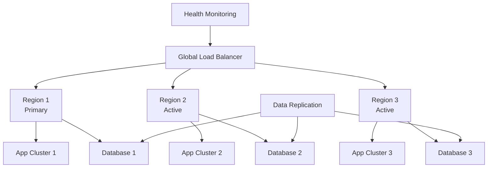
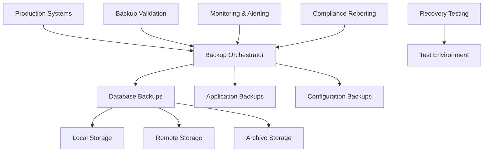

## Reliability & Disaster Recovery

### 16. Multi-Region Active-Active Pattern
**Category:** Reliability

**Problem Statement:** Single region deployments create single points of failure and cannot provide optimal performance for globally distributed users.

**Solution Approach:** Deploy applications across multiple geographic regions with active traffic serving, data replication, and automated failover capabilities.

**Context & Applicability:**
- Global user base requiring low latency
- High availability requirements (99.99%+)
- Disaster recovery needs
- Regulatory data residency requirements
- Mission-critical applications

**Benefits:**
- Improved disaster recovery
- Better global performance
- Higher availability
- Reduced single points of failure
- Supports geographic load distribution

**Trade-offs / Limitations:**
- Complex data consistency management
- Higher infrastructure costs
- Increased operational complexity
- Network latency between regions
- Conflict resolution complexity

**Example Use Case:** Global financial trading platform requiring sub-millisecond latency across continents with 99.999% availability, automatically routing traffic to healthy regions during outages.

**Best Practices:**
- Implement conflict-free replicated data types
- Use database clustering with consensus
- Monitor cross-region replication lag
- Plan for split-brain scenarios
- Test failover procedures regularly

**Anti-Patterns:**
- Not planning for network partitions
- Ignoring data consistency requirements
- Manual failover processes
- Not testing disaster scenarios

---

### 17. Backup and Recovery Automation Pattern
**Category:** Disaster Recovery

**Problem Statement:** Manual backup processes are error-prone, inconsistent, and may not meet recovery time objectives during disasters.

**Solution Approach:** Implement automated backup strategies with multiple recovery points, regular testing, and orchestrated recovery procedures.

**Context & Applicability:**
- Critical data protection requirements
- Compliance and regulatory needs
- Business continuity requirements
- Large-scale data environments
- Multi-tier application architectures

**Benefits:**
- Consistent backup procedures
- Reduced recovery time objectives
- Automated compliance reporting
- Reduced human error
- Cost-optimized storage tiers

**Trade-offs / Limitations:**
- Storage costs for multiple backups
- Network bandwidth requirements
- Complexity in orchestration
- Testing and validation overhead
- Cross-region data transfer costs

**Example Use Case:** Healthcare system automatically backing up patient records, medical images, and system configurations with 15-minute RPO and 4-hour RTO requirements, including automated compliance reporting.

**Best Practices:**
- Implement 3-2-1 backup strategy
- Regular restore testing procedures
- Automate backup validation
- Use immutable backup storage
- Document recovery procedures

**Anti-Patterns:**
- Not testing restore procedures
- Single backup location dependency
- Manual backup verification
- Ignoring encryption for backups

---
