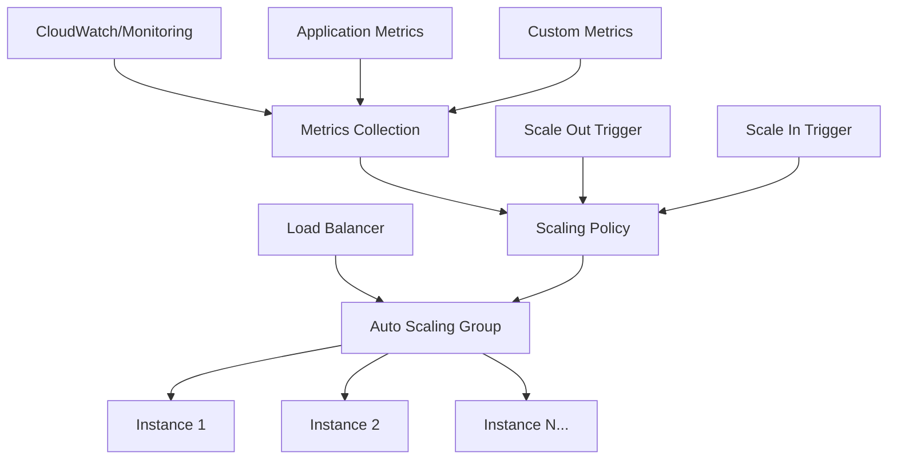
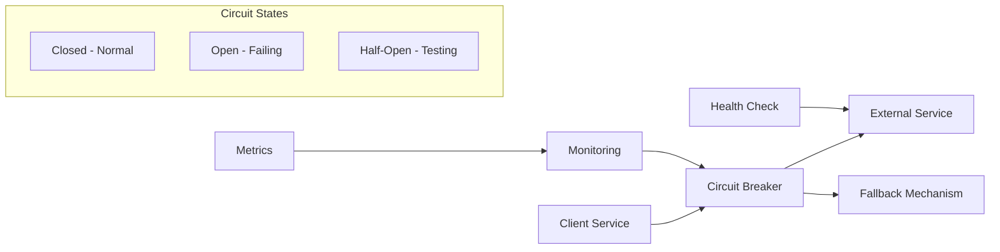
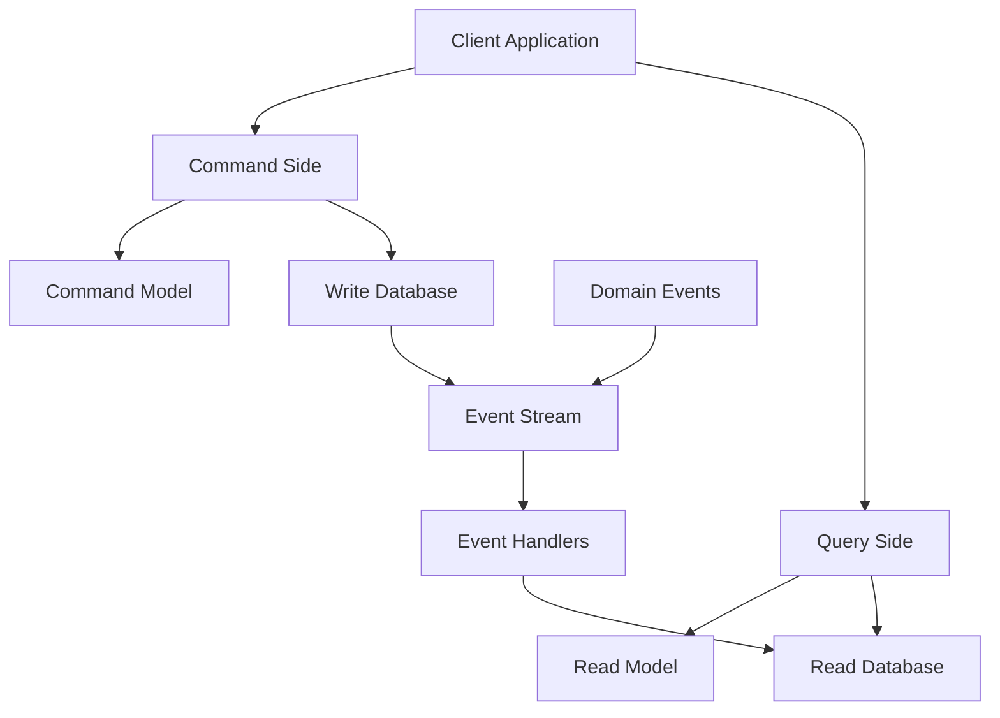

## Scalability & Performance

### 13. Auto-Scaling Pattern
**Category:** Scalability

**Problem Statement:** Application traffic varies significantly over time, leading to either over-provisioning (wasted costs) or under-provisioning (poor performance).

**Solution Approach:** Implement automated scaling based on metrics like CPU utilization, memory usage, request rate, or custom business metrics to dynamically adjust resources.

**Context & Applicability:**
- Variable traffic patterns
- Cloud-native applications
- Cost optimization requirements
- Performance SLA maintenance
- Microservices architectures

**Benefits:**
- Cost optimization through right-sizing
- Improved performance during peak loads
- Automated response to demand
- Better resource utilization
- Reduced manual intervention

**Trade-offs / Limitations:**
- Cold start delays for new instances
- Complex configuration requirements
- Potential scaling oscillation
- Application state management challenges
- Monitoring and alerting complexity

**Example Use Case:** News website experiencing traffic spikes during breaking news events, automatically scaling web servers and database read replicas to handle 10x normal traffic while scaling down during quiet periods.

**Best Practices:**
- Use multiple scaling metrics
- Implement gradual scaling policies
- Plan for stateless application design
- Monitor scaling events and costs
- Test scaling policies regularly

**Anti-Patterns:**
- Using single metric for scaling decisions
- Ignoring application startup time
- Not testing scaling limits
- Scaling based on vanity metrics

---

### 14. Circuit Breaker Pattern
**Category:** Reliability/Performance

**Problem Statement:** Cascading failures occur when dependent services fail, causing resource exhaustion and system-wide outages.

**Solution Approach:** Implement circuit breakers that detect failures and prevent calls to failing services, allowing graceful degradation and system recovery.

**Context & Applicability:**
- Distributed systems with service dependencies
- External service integrations
- Microservices architectures
- Systems requiring high availability
- Services with variable response times

**Benefits:**
- Prevents cascading failures
- Faster failure detection and response
- Improved system resilience
- Better resource utilization
- Enables graceful degradation

**Trade-offs / Limitations:**
- Added complexity in service calls
- Potential for false positives
- Configuration tuning complexity
- Monitoring and alerting requirements
- May mask underlying issues

**Example Use Case:** Payment processing system where circuit breakers protect against failing external payment gateways, falling back to alternative providers or queuing transactions for later processing.

**Best Practices:**
- Implement exponential backoff
- Use health check endpoints
- Monitor circuit breaker metrics
- Implement fallback mechanisms
- Test failure scenarios regularly

**Anti-Patterns:**
- Not implementing fallback strategies
- Using inappropriate timeout values
- Ignoring circuit breaker state monitoring
- Not testing failure scenarios

---

### 15. CQRS (Command Query Responsibility Segregation) Pattern
**Category:** Scalability/Performance

**Problem Statement:** Read and write operations have different performance characteristics and scalability requirements, leading to suboptimal design compromises.

**Solution Approach:** Separate read and write operations into different models, optimizing each for its specific use case and allowing independent scaling.

**Context & Applicability:**
- High-read, low-write scenarios
- Complex domain models
- Event-driven architectures
- Performance optimization needs
- Different consistency requirements

**Benefits:**
- Optimized read and write performance
- Independent scaling of read/write sides
- Simplified query models
- Better security separation
- Supports different data stores

**Trade-offs / Limitations:**
- Increased system complexity
- Eventual consistency challenges
- Data synchronization overhead
- Additional infrastructure requirements
- Higher development complexity

**Example Use Case:** E-commerce platform where product catalog updates are infrequent but product searches and views are high-volume, using optimized read models for search and detailed write models for inventory management.

**Best Practices:**
- Use event sourcing for synchronization
- Implement proper error handling
- Monitor data consistency lag
- Design idempotent operations
- Plan for read model rebuilding

**Anti-Patterns:**
- Applying CQRS to simple CRUD operations
- Not handling eventual consistency
- Creating overly complex read models
- Ignoring operational complexity

---
