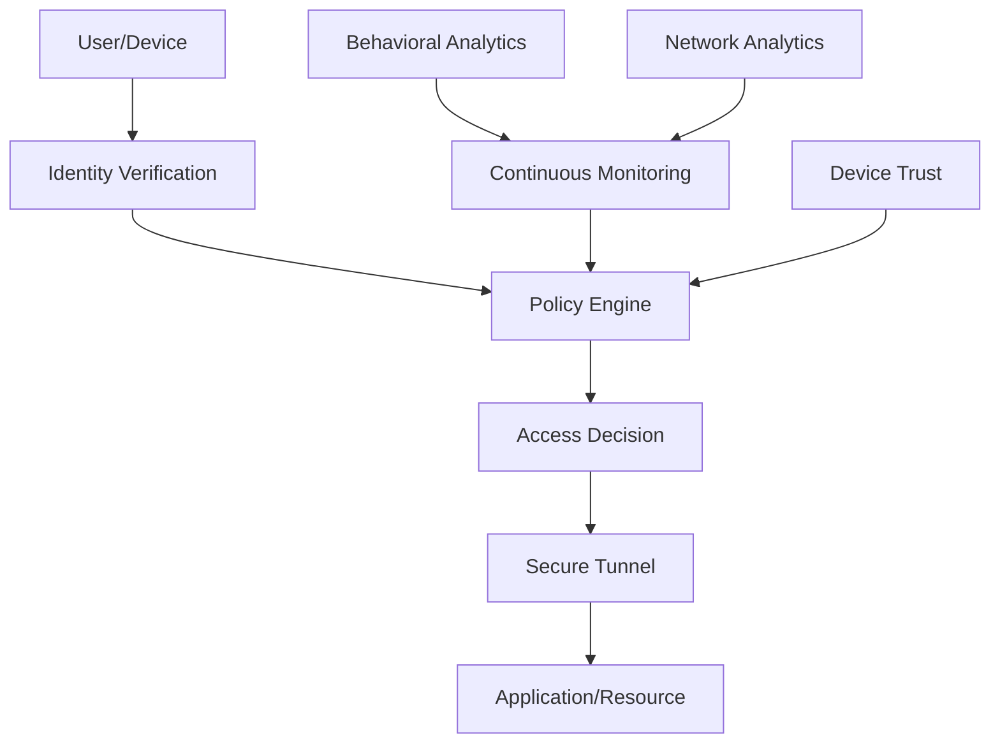
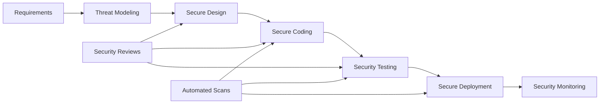
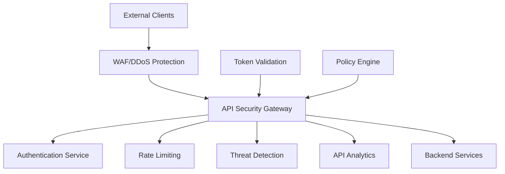

## Security & Compliance

### 7. Zero Trust Architecture Pattern
**Category:** Security

**Problem Statement:** Traditional perimeter-based security fails in modern distributed environments with remote workers, cloud services, and mobile devices.

**Solution Approach:** Implement "never trust, always verify" approach with continuous verification of users, devices, and applications regardless of location.

**Context & Applicability:**
- Remote workforce environments
- Cloud-native applications
- High-security requirements
- Distributed system architectures
- BYOD environments

**Benefits:**
- Enhanced security posture
- Reduced attack surface
- Better visibility and control
- Improved compliance capabilities
- Adaptive security responses

**Trade-offs / Limitations:**
- Implementation complexity
- Potential user experience impact
- Higher initial costs
- Requires cultural change
- Performance overhead

**Example Use Case:** Healthcare organization implementing Zero Trust to secure patient data access across hospitals, remote clinics, and mobile healthcare workers while maintaining HIPAA compliance.

**Best Practices:**
- Implement multi-factor authentication
- Use least privilege access principles
- Continuous monitoring and analytics
- Device trust verification
- Network microsegmentation

**Anti-Patterns:**
- Implementing Zero Trust as a single product
- Not considering user experience
- Ignoring legacy system integration
- Insufficient monitoring and logging

---

### 8. Security by Design Pattern
**Category:** Security

**Problem Statement:** Security vulnerabilities introduced during development are expensive to fix later and can lead to data breaches and compliance issues.

**Solution Approach:** Integrate security controls and considerations throughout the entire software development lifecycle from initial design to deployment.

**Context & Applicability:**
- All software development projects
- Regulated industries
- Customer-facing applications
- Systems handling sensitive data
- DevSecOps environments

**Benefits:**
- Reduced security vulnerabilities
- Lower remediation costs
- Improved compliance posture
- Better security awareness
- Faster security reviews

**Trade-offs / Limitations:**
- Increased development time initially
- Requires security expertise
- Tool integration complexity
- Potential development friction
- Training requirements

**Example Use Case:** Banking application development where security controls are embedded in design patterns, code libraries, CI/CD pipelines, and deployment automation to ensure PCI DSS compliance.

**Best Practices:**
- Implement secure coding standards
- Use automated security testing
- Conduct threat modeling
- Implement security gates in CI/CD
- Regular security training for developers

**Anti-Patterns:**
- Adding security as an afterthought
- Not involving security teams early
- Ignoring automated security tools
- Bypassing security gates for deadlines

---

### 9. API Security Gateway Pattern
**Category:** Security

**Problem Statement:** APIs exposed to external consumers lack consistent security controls, authentication mechanisms, and threat protection.

**Solution Approach:** Implement a dedicated security gateway that enforces authentication, authorization, rate limiting, and threat protection for all API traffic.

**Context & Applicability:**
- Public API exposure
- Partner integrations
- Microservices security
- API monetization platforms
- Mobile backend services

**Benefits:**
- Centralized security enforcement
- Consistent security policies
- Threat protection and monitoring
- Simplified API security management
- Compliance reporting capabilities

**Trade-offs / Limitations:**
- Additional infrastructure complexity
- Potential performance impact
- Single point of failure risk
- Configuration management overhead
- Cost of specialized tools

**Example Use Case:** Retail platform exposing inventory and pricing APIs to third-party sellers, requiring OAuth authentication, rate limiting, and protection against API abuse and data scraping.

**Best Practices:**
- Implement OAuth 2.0/JWT standards
- Use API key management
- Implement proper rate limiting
- Monitor API usage patterns
- Regular security assessments

**Anti-Patterns:**
- Relying solely on network security
- Not implementing proper rate limiting
- Ignoring API versioning security
- Insufficient logging and monitoring

---
